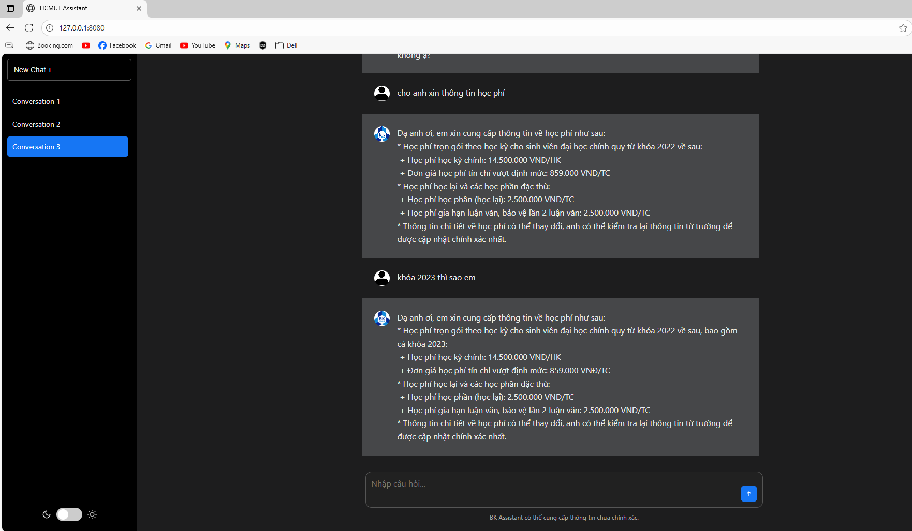
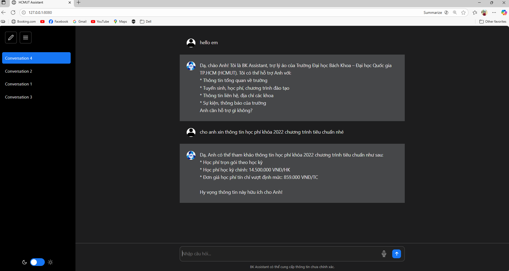

# 🎓 HCMUT AI Agent Chatbot

This project introduces an **AI Chatbot (AI Agent)** developed to provide official and accurate information related to **Ho Chi Minh City University of Technology (HCMUT)**.  
The system is designed to handle student and visitor queries regarding **admissions, academic affairs, scholarships, and campus facilities**, offering a natural and interactive conversational experience.

---

## ✨ Key Features

The chatbot is built to support natural human–computer interaction and can perform the following core functions:

- Initiate conversations and introduce its capabilities.  
- Provide general information about **HCMUT (VNU-HCM)**.  
- Answer questions related to **admission requirements**.  
- Deliver detailed information about **undergraduate and graduate programs**.  
- Provide details on **tuition fees** and **current scholarship policies**.  
- Respond to queries about **campus facilities** and **department contact information**.  

---

## 🔧 Technologies Used

The project is developed with modern technologies, focusing on **Python** for the AI core and backend system.

### **Backend & AI Core**
- [**Python**](https://www.python.org/) — Main programming language.  
- [**FastAPI**](https://fastapi.tiangolo.com/) — For building RESTful API endpoints for the chatbot.  
- [**LangGraph**](https://www.langgraph.com/) — For constructing the AI agent workflow and integrating reasoning components.  
- [**OpenAI (ChatGPT)**](https://openai.com/) — The primary Large Language Model (LLM) responsible for understanding and generating general and up-to-date information.
- [**Groq (GroqAPI)**](https://groq.com/) — Support multiple open-source LLMs.

### **Frontend**
- **HTML**, **CSS**, and **JavaScript** — Served directly from the FastAPI backend to create a lightweight and responsive web interface.  

### **Management & Deployment**
- [**Poetry**](https://python-poetry.org/) — For managing Python dependencies and virtual environments.  
- [**Uvicorn**](https://www.uvicorn.org/) — ASGI web server for running FastAPI applications.  

---

## 🚀 Demo
    
    

## 🔧 Deploy soon...

